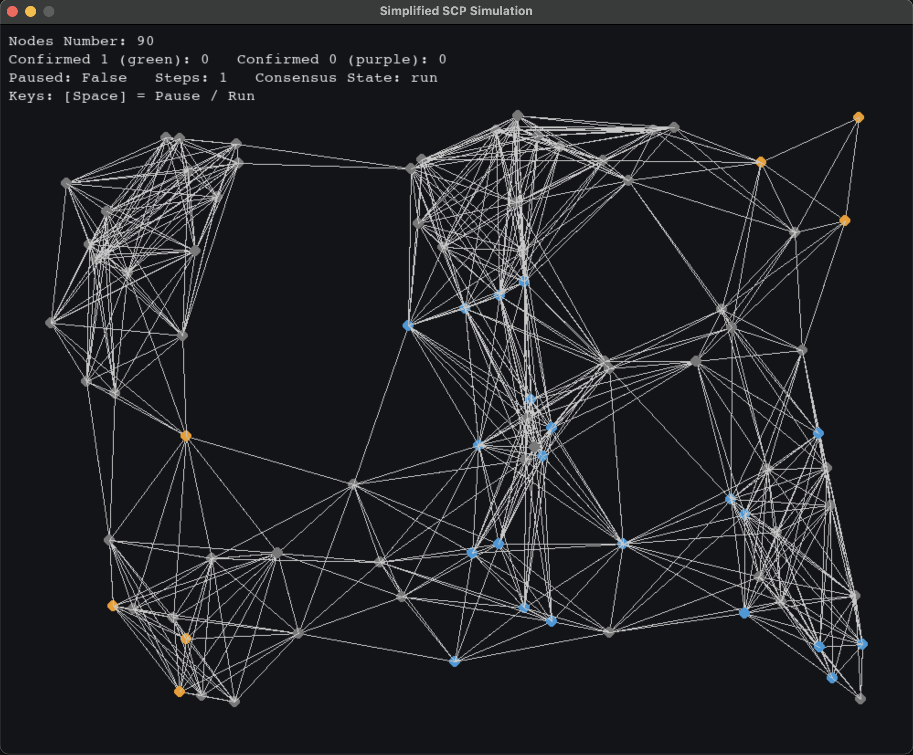

# SCP Simulation

在撰寫論文的研究歷程中，為深入理解SCP（Stellar Consensus Protocol）之運作原理，本人特別進行相關實作練習，涵蓋網路架構建置、提案發起、節點選舉機制與共識達成流程，以強化理論知識與實務操作之整合，提升研究的深度與廣度。

## 壹、基本說明
**一、目標：**
為實現SCP，本專案於單機環境中模擬多個網路節點間的共識流程。系統會隨機生成節點，並透過具廣播能力的單一節點以UDP（User Datagram Protocol）協定建立通訊網路，凡可被搜尋到之節點皆視為信任節點（假設不進行節點的信任投票）。 每個節點將構成一個「投票切片」（Quorum Slice），並向其信任節點發送議題投票請求。當回應的選舉結果超過預設的閾值，即進入「接受階段」（Accept Phase）。 當進入多輪選舉，其投票切片間取得一致意見後，即進入「確認階段」（Confirm Phase），並正式記錄該共識結果。

**二、開發環境：**
以下是開發該平台所採用的環境：
* 程式語言：Python
* 虛擬環境：Anaconda
* 程式編輯器：Visual Studio Code

**三、使用相依套件：**
以下是開發該平台所使用的Python套件：
* Pygame
* Numpy

## 貳、操作說明
**一、安裝程式方式：** 
請從GitHub下載scp.py檔案，具體操作步驟如下所示：
1. 請確認您的電腦已正確安裝Python、Pygame及Numpy套件，以確保程式能順利執行。
2. 請開啟終端機，切換至scp.py所在的資料夾，並執行以下指令：
```bash
python scp.py
```

**二、運行結果：**
執行scp.py後，畫面將呈現出類似以下的模擬結果。
<br>
  <div align="center">
  	
  </div>
<br>
